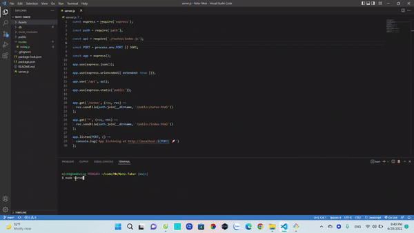

## Badge

## Title
Note Taker
## Table of Contents
- [Badge](#badge)
- [Title](#title)
- [Table of Contents](#table-of-contents)
- [Desscription](#desscription)
- [Usage](#usage)
- [Features](#features)
- [Tech](#tech)
- [License](#license)
- [Testig](#testig)
- [Link](#link)
- [Question](#question)
## Desscription
as a web developer i want an app to write and save notes so i can take note of new programming knowledge i learn

## Usage
GIVEN a note-taking application

WHEN I open the Note Taker

THEN I am presented with a landing page with a link to a notes page

WHEN I click on the link to the notes page

THEN I am presented with a page with existing notes listed in the left-hand column, plus empty fields to enter a new note title and the note’s text in the right-hand column

WHEN I enter a new note title and the note’s text

THEN a Save icon appears in the navigation at the top of the page

WHEN I click on the Save icon

THEN the new note I have entered is saved and appears in the left-hand column 
with the other existing notes

WHEN I click on an existing note in the list in the left-hand column

THEN that note appears in the right-hand column

WHEN I click on the Write icon in the navigation at the top of the page

THEN I am presented with empty fields to enter a new note title and the note’s text in the right-hand column

## Features
Creat notes, Save Notes, Delete Notes

## Tech
HTML, CSS, JAVASCRIPT, NODEJS, HEROKU

## License
None

## Testig

## Link
[Github] https://github.com/minhkhoinguy/Note-Taker

[URL] https://note-taker-mkn.herokuapp.com/notes

## Question
Contact me with the link below if you have any questions!

[Github](https://github.com/minhkhoinguy)

[Email](mailto:minhkhoinguy@gmail.com)

